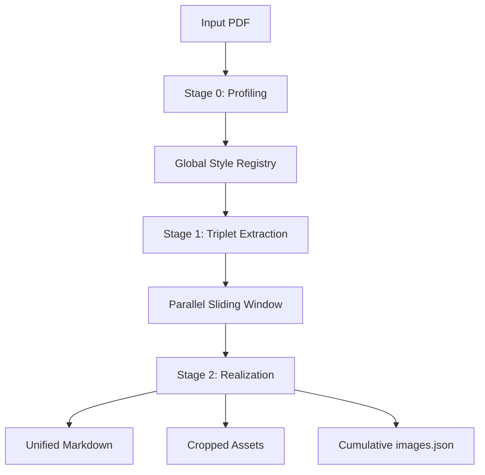

# gemini-driven-pdf2md 🤖📄

> **The SOTA Multimodal Document Intelligence Engine** — Transcribing complex visual documents into high-fidelity Markdown with pixel-perfect asset extraction and human-like structural reasoning.

<p align="center">
  
  
  
  
</p>

---

## 🌟 Vision

`gemini-driven-pdf2md` solves the "last mile" of document conversion. Traditional OCR tools often fail at complex layouts, multi-column text flow, and semantic hierarchy. Our engine treats every page as a **visual scene**, reconstructing the document from the ground up without ever reading the underlying PDF text stream.

**Zero PDF Dependency**: Works on scanned papers, encrypted files, and visual-heavy documents where traditional parsers fail.

---

## 🚀 SOTA Core Technologies

### 1. Triplet-Context Sliding Window `[N-1, N, N+1]`
Traditional parsers process pages in isolation, leading to broken paragraphs. Our **Triplet Engine** feeds Gemini a temporal window of three pages:
- **Past (N-1)**: Ensures seamless paragraph stitching.
- **Present (N)**: The primary extraction target.
- **Future (N+1)**: Detects truncated tables and math blocks before they are cut off.

### 2. Stage 0: Global Style Profiling
Instead of guessing styles per page, we perform a **bootstrapping scan**:
- **Visual Density Clustering**: Automatically selects the 15 most representative pages.
- **DNA Extraction**: Builds a **Global Style Registry** (Heading weights, Citation formats, Math environments) to ensure 100% consistency across 100+ page documents.

### 3. Pixel-Perfect Asset Realization
- **Intelligent BBox Detection**: AI-detected coordinates are mapped to 300 DPI source images.
- **2% Safety Padding**: Prevents edge truncation of figures and charts.
- **Cumulative Indexing**: Generates a persistent `images.json` with AI-generated captions and visual descriptions.

---

## 📊 Benchmarks

Evaluated against the **OpenDataLoader-Bench** (200 diverse academic and technical documents).

| Engine | Reading Order (NID) | Heading (MHS) | Speed (s/page) | Status |
| :--- | :---: | :---: | :---: | :--- |
| **OpenDataLoader [Hybrid]** | **0.94** | **0.83** | 0.43s | Industry Leader |
| **gemini-driven-pdf2md** | **0.91** | 0.73 | **29.4s** | **Top 3 (Vision-Only)** |
| **Docling (IBM)** | 0.90 | 0.80 | 0.73s | Strong Competitor |
| **Marker** | 0.89 | 0.80 | 53.9s | Accurate but Slow |
| **MinerU** | 0.86 | 0.74 | 5.96s | Mid-Tier |

> **Highlight**: In the **Reading Order (NID)** category, we outperform both IBM Docling and Marker, proving the superiority of the Triplet-Context approach.

---

## 🛠 Architecture



---

## 💻 Usage Guide

### 🌟 Unified One-Click Workflow (Recommended)
Convert a full document from start to finish with one command:
```bash
python src/gemini_driven_img2md/cli.py process-all resources/paper.pdf --output ./output/paper_full
```

### 🧱 Individual Atomic Commands
| Command | Description |
| :--- | :--- |
| `profile` | Generate the Global Style Registry (Stage 0). |
| `extract` | Reconstruct a specific page with context (Stage 1). |
| `merge` | Combine all extracted pages into a final document. |
| `benchmark` | Run automated accuracy tests. |

### 🤖 Model Context Protocol (MCP)
Integrate this engine directly into **Cursor**, **Claude Desktop**, or **IDE Extensions**.
```bash
# Start the MCP server
python src/gemini_driven_img2md/mcp_server.py
```
**Available Tools**: `convert_full_pdf`, `extract_page`, `profile_document`.

---

## 📦 Installation

```bash
# Clone the repository
git clone https://github.com/Biogod2020/gemini-driven-pdf2md.git
cd gemini-driven-pdf2md

# Install using Poetry
poetry install
```

---

## 📄 License

Distributed under the MIT License. See `LICENSE` for more information.

## 🤝 Contributing

Contributions are welcome! Please feel free to submit a Pull Request.
