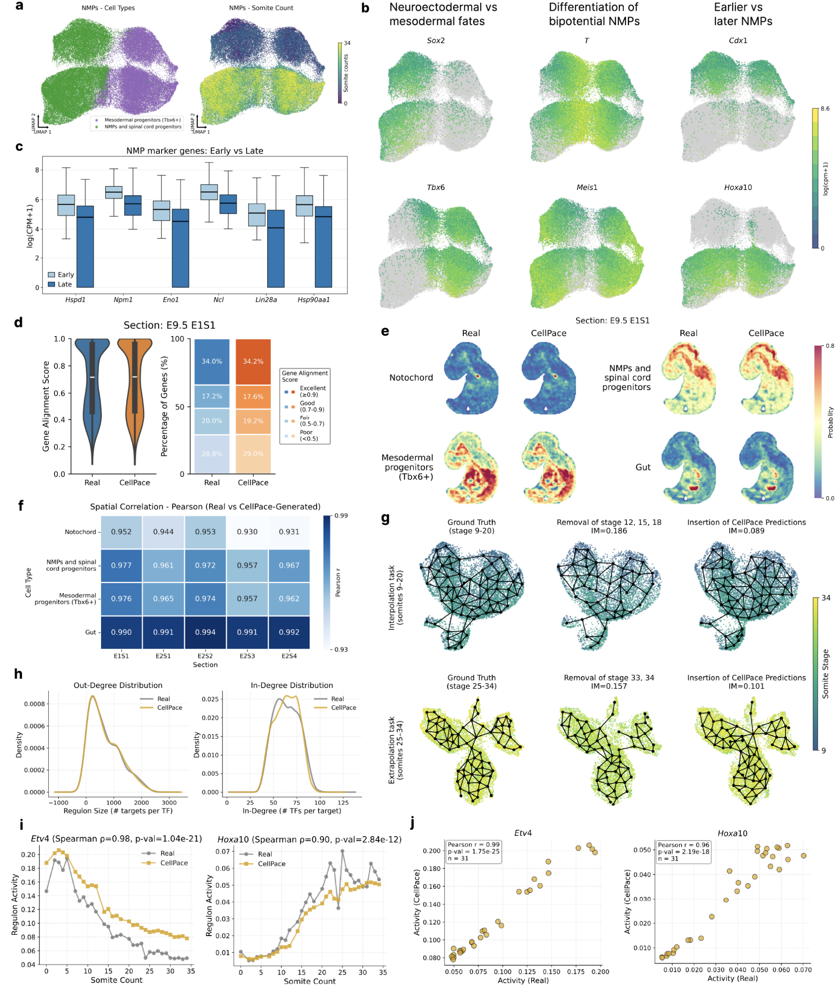

**Fig. 4 | Analysis of biological signals in CellPace-generated posterior embryo samples.** **a**, UMAP visualization of CellPace-generated neuromesodermal progenitors (NMPs) and mesodermal progenitors. Left: Cells colored by inferred cell identity, showing the separation of NMP/spinal cord progenitors (green) and mesodermal progenitors (purple). Right: Cells colored by somite counts, illustrating the continuous developmental dynamics from early (purple) to late (yellow) stages. **b**, Marker expression plots showing log-normalized expression of key regulatory genes, organized by biological function (columns). Left column: Complementary expression patterns of neuroectodermal ($Sox2$) versus mesodermal ($Tbx6$) fates. Middle column: Distinction between the bipotential NMP state ($T$) and differentiated progenitors ($Meis1$). Right column: Spatially distinct expression patterns corresponding to early ($Cdx1$) versus late ($Hoxa10$) temporal identity. **c**, Box plots of expression levels for metabolic and maintenance genes. Analysis is restricted to generated cells matching the specific NMP molecular signature, defined in [15]. Comparison groups are defined by developmental stage: Early (before somite 14) versus Late (somite 14 and after). Boxes denote the interquartile range (IQR), center lines mark medians, and whiskers extend to 1.5xIQR. **d**, Evaluation of single cell mapping to the Mouse Organogenesis Spatiotemporal Transcriptomic Atlas (MOSTA) using Tangram. Violin plots (left) and stacked bar charts (right) summarize the distribution of gene alignment scores for real and CellPace-generated scRNA-seq profiles mapped to spatial transcriptomics spots in the E9.5 embryo section E1S1. **e**, Spatial localization of predicted cell populations. Spatial probability maps for representative lineages (notochord, neuromesodermal progenitors and spinal cord progenitors, mesodermal progenitors, and gut) shown for section E1S1. Maps are obtained by mapping real (left) and CellPace-generated (right) scRNA-seq profiles to MOSTA spatial transcriptomics data using Tangram. **f**, Quantitative comparison of spatial probability maps. Heatmap showing Pearson correlation coefficients between spatial probability maps derived from real and CellPace-generated data, computed for four cell types across five anatomical sections (E1S1, E2S1-E2S4). **g**, Trajectory recovery analysis using PAGA graphs. Top: Interpolation task (Somite stages 9-20). Bottom: Extrapolation task. Graphs compare the topology of Ground Truth (left), the incomplete reference (middle), and the trajectory after inserting CellPace predictions (right). Structural dissimilarity is quantified using the Ipsen-Mikhailov (IM) distance, where lower values indicate greater topological similarity to the ground truth. **h**, Network topology comparison of gene regulatory networks (GRNs) inferred from real (grey) and CellPace-generated (gold) data. Curves show the kernel density estimates for out-degree (targets per TF) and in-degree (TFs per target) distributions. **i**, Temporal dynamics of key regulons. Line plots show the mean regulon activity of $Etv4$ and $Hoxa10$ across somite stages for real (grey) and CellPace-generated (gold) data. **j**, Comparison of regulon activity levels. Scatter plots showing the mean activity of $Etv4$ and $Hoxa10$ for real (x-axis) and CellPace (y-axis) data across all somite stages.

14
