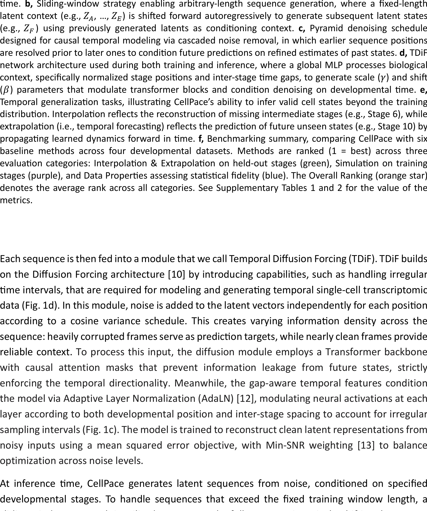

time. **b**, Sliding-window strategy enabling arbitrary-length sequence generation, where a fixed-length latent context (e.g., $Z_A, ..., Z_E$) is shifted forward autoregressively to generate subsequent latent states (e.g., $Z_F$) using previously generated latents as conditioning context. **c**, Pyramid denoising schedule designed for causal temporal modeling via cascaded noise removal, in which earlier sequence positions are resolved prior to later ones to condition future predictions on refined estimates of past states. **d**, TDiF network architecture used during both training and inference, where a global MLP processes biological context, specifically normalized stage positions and inter-stage time gaps, to generate scale ($\gamma$) and shift ($\beta$) parameters that modulate transformer blocks and condition denoising on developmental time. **e**, Temporal generalization tasks, illustrating CellPace’s ability to infer valid cell states beyond the training distribution. Interpolation reflects the reconstruction of missing intermediate stages (e.g., Stage 6), while extrapolation (i.e., temporal forecasting) reflects the prediction of future unseen states (e.g., Stage 10) by propagating learned dynamics forward in time. **f**, Benchmarking summary, comparing CellPace with six baseline methods across four developmental datasets. Methods are ranked (1 = best) across three evaluation categories: Interpolation & Extrapolation on held-out stages (green), Simulation on training stages (purple), and Data Properties assessing statistical fidelity (blue). The Overall Ranking (orange star) denotes the average rank across all categories. See Supplementary Tables 1 and 2 for the value of the metrics.

Each sequence is then fed into a module that we call Temporal Diffusion Forcing (TDiF). TDiF builds on the Diffusion Forcing architecture [10] by introducing capabilities, such as handling irregular time intervals, that are required for modeling and generating temporal single-cell transcriptomic data (Fig. 1d). In this module, noise is added to the latent vectors independently for each position according to a cosine variance schedule. This creates varying information density across the sequence: heavily corrupted frames serve as prediction targets, while nearly clean frames provide reliable context. To process this input, the diffusion module employs a Transformer backbone with causal attention masks that prevent information leakage from future states, strictly enforcing the temporal directionality. Meanwhile, the gap-aware temporal features condition the model via Adaptive Layer Normalization (AdaLN) [12], modulating neural activations at each layer according to both developmental position and inter-stage spacing to account for irregular sampling intervals (Fig. 1c). The model is trained to reconstruct clean latent representations from noisy inputs using a mean squared error objective, with Min-SNR weighting [13] to balance optimization across noise levels.

At inference time, CellPace generates latent sequences from noise, conditioned on specified developmental stages. To handle sequences that exceed the fixed training window length, a sliding window approach is utilized to generate the full sequence iteratively, shifting the context forward step-by-step. Within each window generation, instead of denoising all timepoints synchronously, the model employs a Pyramid Schedule [10] (Fig. 1b-1c) in conjunction with a Denoising Diffusion Implicit Models (DDIM) sampler [14] for accelerated inference. The pyramid schedule allocates denoising effort asymmetrically across timepoints, stabilizing earlier stages

6
