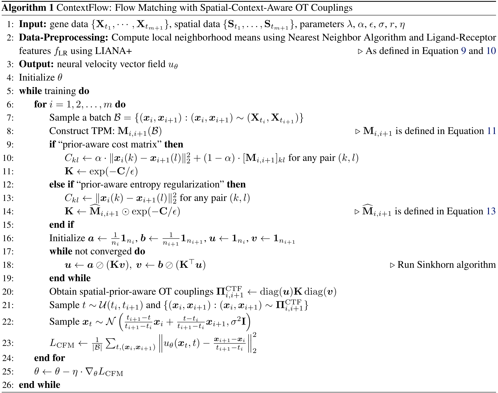

# Context-Aware Flow Matching for Trajectory Inference from Spatial Omics Data

## E. Detailed Analysis of ContextFlow

### E.1. Algorithm Pseudocode

**Algorithm 1** ContextFlow: Flow Matching with Spatial-Context-Aware OT Couplings
1: **Input:** gene data $\{\mathbf{X}_{t_1}, \dots, \mathbf{X}_{t_{m+1}}\}$, spatial data $\{\mathbf{S}_{t_1}, \dots, \mathbf{S}_{t_{m+1}}\}$, parameters $\lambda, \alpha, \epsilon, \sigma, r, \eta$
2: **Data-Preprocessing:** Compute local neighborhood means using Nearest Neighbor Algorithm and Ligand-Receptor features $f_{\text{LR}}$ using LIANA+ $\triangleright$ As defined in Equation 9 and 10
3: **Output:** neural velocity vector field $u_\theta$
4: Initialize $\theta$
5: **while** training **do**
6: &nbsp;&nbsp;&nbsp;&nbsp;**for** $i = 1, 2, \dots, m$ **do**
7: &nbsp;&nbsp;&nbsp;&nbsp;&nbsp;&nbsp;&nbsp;&nbsp;Sample a batch $\mathcal{B} = \{(\boldsymbol{x}_i, \boldsymbol{x}_{i+1}) : (\boldsymbol{x}_i, \boldsymbol{x}_{i+1}) \sim (\mathbf{X}_{t_i}, \mathbf{X}_{t_{i+1}})\}$
8: &nbsp;&nbsp;&nbsp;&nbsp;&nbsp;&nbsp;&nbsp;&nbsp;Construct TPM: $\mathbf{M}_{i,i+1}(\mathcal{B})$ $\triangleright$ $\mathbf{M}_{i,i+1}$ is defined in Equation 11
9: &nbsp;&nbsp;&nbsp;&nbsp;&nbsp;&nbsp;&nbsp;&nbsp;**if** "prior-aware cost matrix" **then**
10: &nbsp;&nbsp;&nbsp;&nbsp;&nbsp;&nbsp;&nbsp;&nbsp;&nbsp;&nbsp;&nbsp;&nbsp;$C_{kl} \leftarrow \alpha \cdot \|\boldsymbol{x}_i(k) - \boldsymbol{x}_{i+1}(l)\|_2^2 + (1 - \alpha) \cdot [\mathbf{M}_{i,i+1}]_{kl}$ for any pair $(k, l)$
11: &nbsp;&nbsp;&nbsp;&nbsp;&nbsp;&nbsp;&nbsp;&nbsp;&nbsp;&nbsp;&nbsp;&nbsp;$\mathbf{K} \leftarrow \exp(-\mathbf{C}/\epsilon)$
12: &nbsp;&nbsp;&nbsp;&nbsp;&nbsp;&nbsp;&nbsp;&nbsp;**else if** "prior-aware entropy regularization" **then**
13: &nbsp;&nbsp;&nbsp;&nbsp;&nbsp;&nbsp;&nbsp;&nbsp;&nbsp;&nbsp;&nbsp;&nbsp;$C_{kl} \leftarrow \|\boldsymbol{x}_i(k) - \boldsymbol{x}_{i+1}(l)\|_2^2$ for any pair $(k, l)$
14: &nbsp;&nbsp;&nbsp;&nbsp;&nbsp;&nbsp;&nbsp;&nbsp;&nbsp;&nbsp;&nbsp;&nbsp;$\mathbf{K} \leftarrow \widehat{\mathbf{M}}_{i,i+1} \odot \exp(-\mathbf{C}/\epsilon)$ $\triangleright$ $\widehat{\mathbf{M}}_{i,i+1}$ is defined in Equation 13
15: &nbsp;&nbsp;&nbsp;&nbsp;&nbsp;&nbsp;&nbsp;&nbsp;**end if**
16: &nbsp;&nbsp;&nbsp;&nbsp;&nbsp;&nbsp;&nbsp;&nbsp;Initialize $\boldsymbol{a} \leftarrow \frac{1}{n_i}\mathbf{1}_{n_i}$, $\boldsymbol{b} \leftarrow \frac{1}{n_{i+1}}\mathbf{1}_{n_{i+1}}$, $\boldsymbol{u} \leftarrow \mathbf{1}_{n_i}$, $\boldsymbol{v} \leftarrow \mathbf{1}_{n_{i+1}}$
17: &nbsp;&nbsp;&nbsp;&nbsp;&nbsp;&nbsp;&nbsp;&nbsp;**while** not converged **do**
18: &nbsp;&nbsp;&nbsp;&nbsp;&nbsp;&nbsp;&nbsp;&nbsp;&nbsp;&nbsp;&nbsp;&nbsp;$\boldsymbol{u} \leftarrow \boldsymbol{a} \oslash (\mathbf{K}\boldsymbol{v})$, $\boldsymbol{v} \leftarrow \boldsymbol{b} \oslash (\mathbf{K}^\top\boldsymbol{u})$ $\triangleright$ Run Sinkhorn algorithm
19: &nbsp;&nbsp;&nbsp;&nbsp;&nbsp;&nbsp;&nbsp;&nbsp;**end while**
20: &nbsp;&nbsp;&nbsp;&nbsp;&nbsp;&nbsp;&nbsp;&nbsp;Obtain spatial-prior-aware OT couplings $\boldsymbol{\Pi}_{i,i+1}^{\text{CTF}} \leftarrow \text{diag}(\boldsymbol{u})\mathbf{K} \text{diag}(\boldsymbol{v})$
21: &nbsp;&nbsp;&nbsp;&nbsp;&nbsp;&nbsp;&nbsp;&nbsp;Sample $t \sim \mathcal{U}(t_i, t_{i+1})$ and $\{(\boldsymbol{x}_i, \boldsymbol{x}_{i+1}) : (\boldsymbol{x}_i, \boldsymbol{x}_{i+1}) \sim \boldsymbol{\Pi}_{i,i+1}^{\text{CTF}}\}$
22: &nbsp;&nbsp;&nbsp;&nbsp;&nbsp;&nbsp;&nbsp;&nbsp;Sample $\boldsymbol{x}_t \sim \mathcal{N}\left(\frac{t_{i+1}-t}{t_{i+1}-t_i}\boldsymbol{x}_i + \frac{t-t_i}{t_{i+1}-t_i}\boldsymbol{x}_{i+1}, \sigma^2\mathbf{I}\right)$
23: &nbsp;&nbsp;&nbsp;&nbsp;&nbsp;&nbsp;&nbsp;&nbsp;$\mathcal{L}_{\text{CFM}} \leftarrow \frac{1}{|\mathcal{B}|} \sum_{t, (\boldsymbol{x}_i, \boldsymbol{x}_{i+1})} \left\| u_\theta(\boldsymbol{x}_t, t) - \frac{\boldsymbol{x}_{i+1}-\boldsymbol{x}_i}{t_{i+1}-t_i} \right\|_2^2$
24: &nbsp;&nbsp;&nbsp;&nbsp;**end for**
25: &nbsp;&nbsp;&nbsp;&nbsp;$\theta \leftarrow \theta - \eta \cdot \nabla_\theta \mathcal{L}_{\text{CFM}}$
26: **end while**

---

### E.2. Time Complexity Analysis

The training time of ContextFlow is comparable to that of Minibatch-OT FM (Tong et al., 2024) (Figure 3), as both methods solve an entropic variant of optimal transport using the GPU-optimized Sinkhorn algorithm, alongside forward and backward propagation steps that are also GPU-accelerated. Although ContextFlow incorporates prior knowledge, such as spatial smoothness (Equation 9) and cell-cell communication patterns (Equation 10), their corresponding features are computed once during preprocessing, resulting in a one-time cost. The precomputed features can be reused across multiple hyperparameter settings and model variants, making ContextFlow highly scalable and efficient.

**Data Preprocessing.** The following preprocessing steps generate additional biologically informed features that complement the original transcriptomic profiles. These features incur a one-time computational cost and can be reused across different experiments and model configurations.

*Spatial Smoothness (SS).* We employ a nearest neighbor (NN) algorithm for calculating the mean of local transcriptomic features for each cell. The computational complexity of the NN search is known to be $O(N^2d)$, where $N$ denotes the total number of points considered and $d$ denotes the data dimension.

20