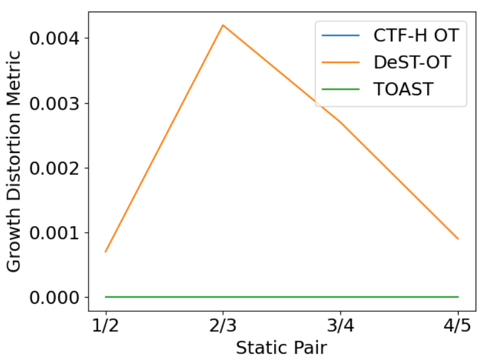
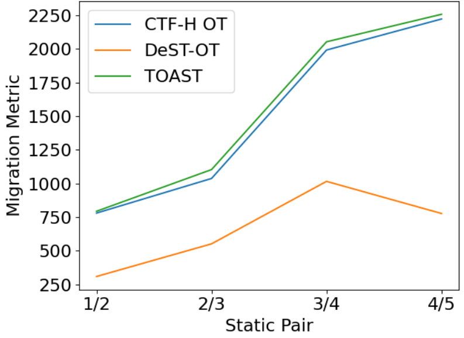

### F.1. Metric Comparison

DeST-OT introduces an OT objective for aligning spatial transcriptomic tissue slices from different developmental timesteps, with an emphasis on modeling cell growth and tissue expansion/contraction. The growth distortion metric is designed to assess whether the inferred growth pattern aligns with the changes in cell-type abundance across timesteps. As shown in Table 7, for the growth distortion metric, we find that our CTF-H OT is competitive with DeST-OT and TOAST, despite DeST-OT being specifically developed with consideration for cell growth.

| Table 7. Comparison on growth distortion. | | | |
| :--- | :---: | :---: | :---: |
| **Static Pair** | **DeST-OT** | **TOAST** | **CTF-H OT** |
| 1/2 | 0.0007 | 0.0000 | 0.0000 |
| 2/3 | 0.0042 | 0.0000 | 0.0000 |
| 3/4 | 0.0027 | 0.0000 | 0.0000 |
| 4/5 | 0.0009 | 0.0000 | 0.0000 |

The migration metric is another important metric introduced in DeST-OT, which measures whether the coupling results in realistic cell movements between timesteps. As seen in Table 8, DeST-OT achieves the best performance, highlighting the advantage of its growth-aware objective compared to TOAST and CTF-H OT, which do not explicitly model tissue expansion or contraction.

| Table 8. Comparison on migration. | | | |
| :--- | :---: | :---: | :---: |
| **Static Pair** | **DeST-OT** | **TOAST** | **CTF-H OT** |
| 1/2 | 308.97 | 793.71 | 780.16 |
| 2/3 | 551.53 | 1103.29 | 1037.29 |
| 3/4 | 1015.73 | 2052.65 | 1991.43 |
| 4/5 | 777.13 | 2257.02 | 2222.07 |

Lastly, we compute how similar the transcriptomic values of coupled cells are using a *Coupled Transcriptomic Distance* metric, which is defined as $\sum_{k=1}^{N} \sum_{l=1}^{M} \left\| X_{t_i}[k, :] - X_{t_{i+1}}[l, :] \right\|^2 \times \Pi_{i,j}$, where $X_{t_i}[k, :]$ represents the transcriptomic feature of cell $k$ from timestep $t_i$ and $X_{t_{i+1}}[l, :]$ represents the transcriptomic feature of cell $l$ from timestep $t_{i+1}$, and $\Pi$ is the OT coupling matrix. From Table 9, we can observe that CTF-H OT is competitive with both DeST and TOAST.