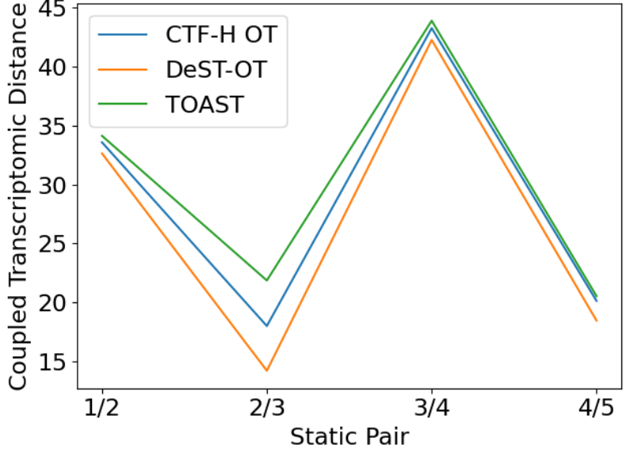
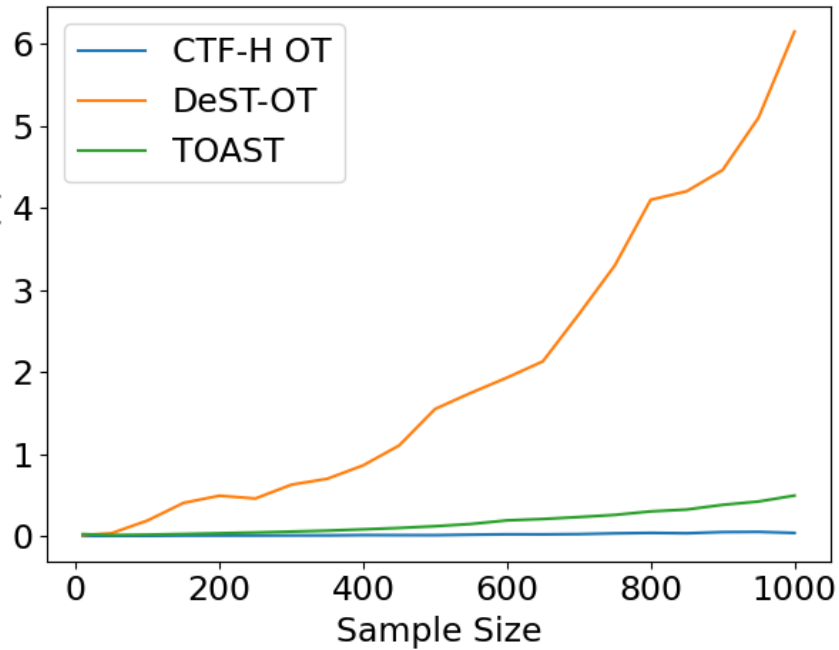

# Context-Aware Flow Matching for Trajectory Inference from Spatial Omics Data

*Table 9. On coupled transcriptomic distance.*

| Static Pair | DeST-OT | TOAST | CTF-H OT |
| :--- | :---: | :---: | :---: |
| 1/2 | 32.64 | 34.13 | 33.58 |
| 2/3 | 14.22 | 21.87 | 18.01 |
| 3/4 | 42.26 | 43.89 | 43.26 |
| 4/5 | 18.47 | 20.54 | 20.14 |

### F.2. Runtime Analysis with Varying Sample Size

We also compare the runtime complexity of the above-mentioned OT methods, as shown in Table 10. CTF-H OT is the fastest of the three, followed by DeST-OT and TOAST, and is competitive in the metrics above. We also observe that DeST-OT is the slowest, as expected, since its OT objective includes a Gromov-Wasserstein term, which has $O(n^3)$ runtime, along with other growth- and tissue-distortion-specific terms.

*Table 10. Runtime (s) with varying sample size.*

| Sample Size | DeST-OT | TOAST | CTF-OT |
| :--- | :---: | :---: | :---: |
| 10 | 0.0111 | 0.0227 | 0.0009 |
| 50 | 0.0342 | 0.0114 | 0.0018 |
| 100 | 0.1892 | 0.0167 | 0.0024 |
| 150 | 0.4035 | 0.0247 | 0.0053 |
| 200 | 0.4913 | 0.0337 | 0.0059 |
| 250 | 0.4571 | 0.0426 | 0.0061 |
| 300 | 0.6252 | 0.0543 | 0.0074 |
| 350 | 0.6974 | 0.0656 | 0.0078 |
| 400 | 0.8612 | 0.0817 | 0.0117 |
| 450 | 1.1028 | 0.0983 | 0.0110 |
| 500 | 1.5478 | 0.1197 | 0.0107 |
| 550 | 1.7448 | 0.1468 | 0.0165 |
| 600 | 1.9295 | 0.1905 | 0.0209 |
| 650 | 2.1282 | 0.2077 | 0.0201 |
| 700 | 2.7013 | 0.2309 | 0.0235 |
| 750 | 3.2951 | 0.2574 | 0.0327 |
| 800 | 4.0964 | 0.3001 | 0.0382 |
| 850 | 4.2001 | 0.3229 | 0.0339 |
| 900 | 4.4582 | 0.3798 | 0.0483 |
| 950 | 5.0965 | 0.4206 | 0.0509 |
| 1000 | 6.1452 | 0.4931 | 0.0375 |

Tables 7-10 demonstrate that the design choices of ContextFlow enable it to be highly scalable compared to state-of-the-art spatiotemporal alignment methods, while remaining competitive across several spatiotemporal OT alignment metrics.