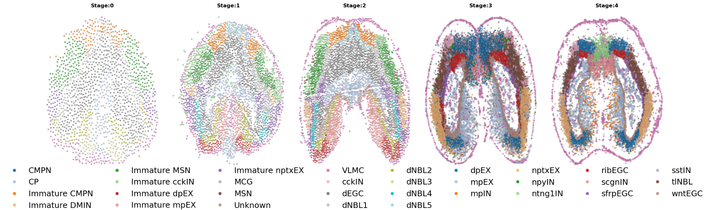
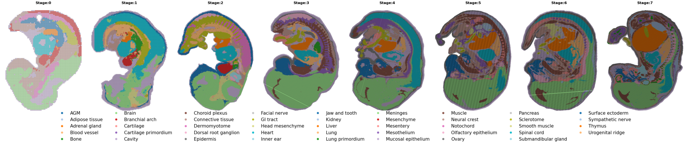

**Context-Aware Flow Matching for Trajectory Inference from Spatial Omics Data**

nptxEX, (ii) Immature MSN $\rightarrow$ Immature dpEX, (iii) Immature MSN $\rightarrow$ Immature CMPN, (iv) Immature nptxEX $\rightarrow$ Immature cckIN, and (v) Immature nptxEX $\rightarrow$ Immature MSN

Of these, 54 implausible transitions arose from the Entropic-OT plan, compared to 24 from the PAER-OT plan, with the specific transitions detailed in the figure legends. We also observed that the Entropic-OT formulation produced implausible transitions across brain hemispheres, for example, coupling cells from the left hemisphere with those from the right. In contrast, the PAER-OT formulation typically restricted transitions to within the same hemisphere, reflecting its integration of spatially aware contextual information. These observations provide strong motivation for incorporating biological priors through ContextFlow as a principled approach to learning biologically consistent developmental trajectories.

### G.2. Cell type distributions over time

Figures 5–7 present spatial maps of transcriptomic datasets across different time points, illustrating how tissue organization and cell-type distributions evolve during development and regeneration. These maps highlight not only changes in cellular composition but also the preservation of spatial neighborhoods and geometrical arrangements of specific cell types over time. Such contextual information, specific to spatial transcriptomics, remains inaccessible to standard flow-matching frameworks. By contrast, ContextFlow is designed to exploit these spatial features, enabling the inference of trajectories that are both temporally smooth and spatially coherent.

#### G.2.1. BRAIN REGENERATION

#### G.2.2. MOUSE EMBRYO ORGANOGENESIS

