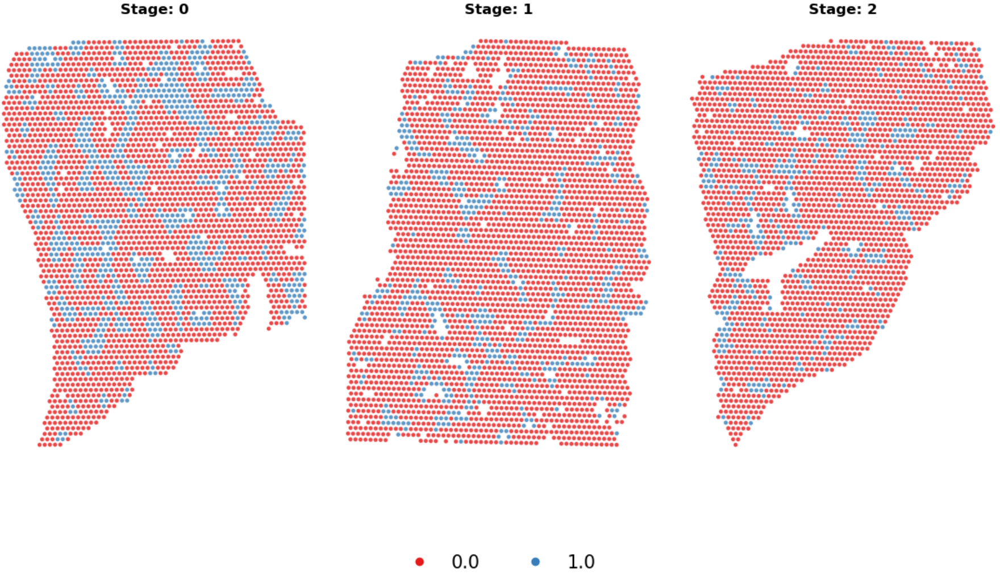
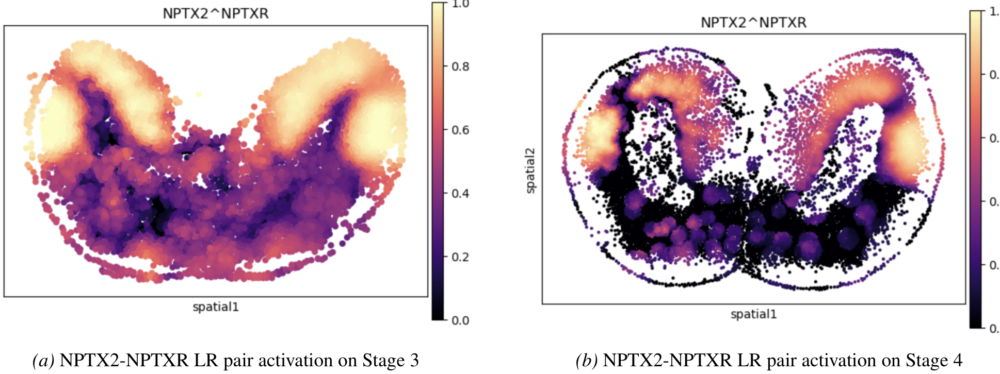

#### G.2.3. LIVER REGENERATION

### G.3. Ligand Receptor Interactions

Figure 8 shows the ligand-receptor score of the NPTX2-NPTXR pair in two consecutive slides from the Brain regeneration dataset (Wei et al., 2022). Similar activities are visible bilaterally in the cerebral cortex, suggesting that ligand–receptor interactions are preserved across time and spatially aligned with underlying tissue structure. This observation provides strong evidence that including LR interactions as contextual priors is biologically meaningful, as they capture functional communication signals between cells that remain stable across short time intervals.

Based on the activation of NPTX2–NPTXR in Figure 8, we observe that the corresponding communication pattern naturally