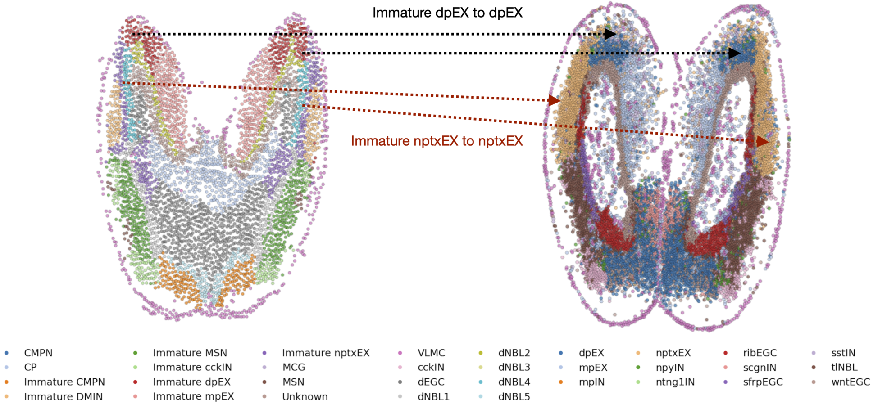

**Context-Aware Flow Matching for Trajectory Inference from Spatial Omics Data**

biases the optimal couplings towards transitions such as Immature dpEX $\rightarrow$ dpEX and Immature nptxEX $\rightarrow$ nptxEX (Figure 9). These transitions are biologically plausible, as they preserve cell type identity within excitatory neuronal lineages while reflecting maturation within the same functional context. This example highlights the richness of the contextual information captured by our proposed biological prior and demonstrates how incorporating such ligand–receptor–driven cues into the coupling process yields more interpretable, biologically consistent trajectories.

*   CMPN
*   CP
*   Immature CMPN
*   Immature DMIN
*   Immature MSN
*   Immature cckIN
*   Immature dpEX
*   Immature mpEX
*   Immature nptxEX
*   MCG
*   MSN
*   Unknown
*   VLMC
*   cckIN
*   dEGC
*   dNBL1
*   dNBL2
*   dNBL3
*   dNBL4
*   dNBL5
*   dpEX
*   mpEX
*   mplN
*   nptxEX
*   npyIN
*   ntng1IN
*   ribEGC
*   scgnIN
*   sfrpEGC
*   sstIN
*   tlNBL
*   wntEGC

*Figure 9. Visual translation of the bias that NPTX2–NPTXR LR pattern provides in terms of cell type coupling for two consecutive slides.*

 

27