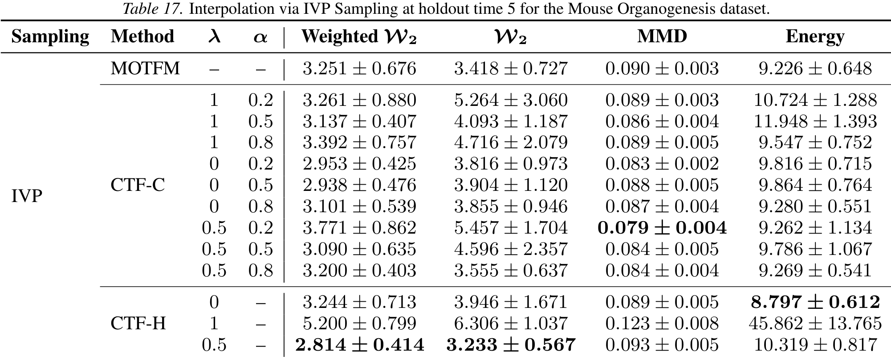
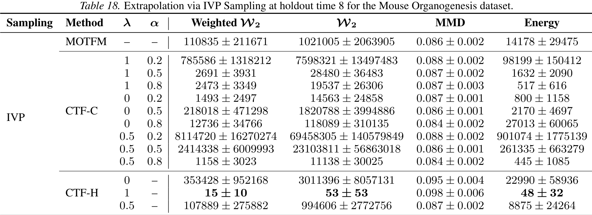
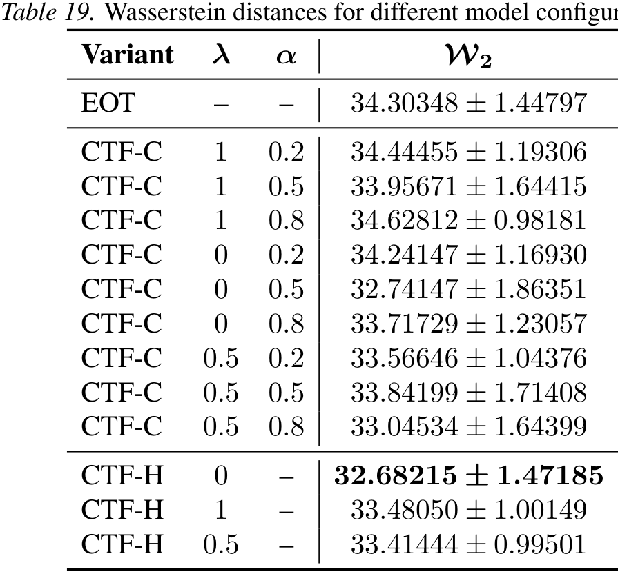

# Context-Aware Flow Matching for Trajectory Inference from Spatial Omics Data

*Table 17. Interpolation via IVP Sampling at holdout time 5 for the Mouse Organogenesis dataset.*

| Sampling | Method | $\lambda$ | $\alpha$ | Weighted $\mathcal{W}_2$ | $\mathcal{W}_2$ | MMD | Energy |
| :--- | :--- | :--- | :--- | :--- | :--- | :--- | :--- |
| IVP | MOTFM | $-$ | $-$ | $3.251 \pm 0.676$ | $3.418 \pm 0.727$ | $0.090 \pm 0.003$ | $9.226 \pm 0.648$ |
| | CTF-C | $1$ | $0.2$ | $3.261 \pm 0.880$ | $5.264 \pm 3.060$ | $0.089 \pm 0.003$ | $10.724 \pm 1.288$ |
| | | $1$ | $0.5$ | $3.137 \pm 0.407$ | $4.093 \pm 1.187$ | $0.086 \pm 0.004$ | $11.948 \pm 1.393$ |
| | | $1$ | $0.8$ | $3.392 \pm 0.757$ | $4.716 \pm 2.079$ | $0.089 \pm 0.005$ | $9.547 \pm 0.752$ |
| | | $0$ | $0.2$ | $2.953 \pm 0.425$ | $3.816 \pm 0.973$ | $0.083 \pm 0.002$ | $9.816 \pm 0.715$ |
| | | $0$ | $0.5$ | $2.938 \pm 0.476$ | $3.904 \pm 1.120$ | $0.088 \pm 0.005$ | $9.864 \pm 0.764$ |
| | | $0$ | $0.8$ | $3.101 \pm 0.539$ | $3.855 \pm 0.946$ | $0.087 \pm 0.004$ | $9.280 \pm 0.551$ |
| | | $0.5$ | $0.2$ | $3.771 \pm 0.862$ | $5.457 \pm 1.704$ | $\mathbf{0.079 \pm 0.004}$ | $9.262 \pm 1.134$ |
| | | $0.5$ | $0.5$ | $3.090 \pm 0.635$ | $4.596 \pm 2.357$ | $0.084 \pm 0.005$ | $9.786 \pm 1.067$ |
| | | $0.5$ | $0.8$ | $3.200 \pm 0.403$ | $3.555 \pm 0.637$ | $0.084 \pm 0.004$ | $9.269 \pm 0.541$ |
| | CTF-H | $0$ | $-$ | $3.244 \pm 0.713$ | $3.946 \pm 1.671$ | $0.089 \pm 0.005$ | $\mathbf{8.797 \pm 0.612}$ |
| | | $1$ | $-$ | $5.200 \pm 0.799$ | $6.306 \pm 1.037$ | $0.123 \pm 0.008$ | $45.862 \pm 13.765$ |
| | | $0.5$ | $-$ | $\mathbf{2.814 \pm 0.414}$ | $\mathbf{3.233 \pm 0.567}$ | $0.093 \pm 0.005$ | $10.319 \pm 0.817$ |

*Table 18. Extrapolation via IVP Sampling at holdout time 8 for the Mouse Organogenesis dataset.*

| Sampling | Method | $\lambda$ | $\alpha$ | Weighted $\mathcal{W}_2$ | $\mathcal{W}_2$ | MMD | Energy |
| :--- | :--- | :--- | :--- | :--- | :--- | :--- | :--- |
| IVP | MOTFM | $-$ | $-$ | $110835 \pm 211671$ | $1021005 \pm 2063905$ | $0.086 \pm 0.002$ | $14178 \pm 29475$ |
| | CTF-C | $1$ | $0.2$ | $785586 \pm 1318212$ | $7598321 \pm 13497483$ | $0.088 \pm 0.002$ | $98199 \pm 150412$ |
| | | $1$ | $0.5$ | $2691 \pm 3931$ | $28480 \pm 36483$ | $0.087 \pm 0.002$ | $1632 \pm 2090$ |
| | | $1$ | $0.8$ | $2473 \pm 3349$ | $19537 \pm 26306$ | $0.087 \pm 0.003$ | $517 \pm 616$ |
| | | $0$ | $0.2$ | $1493 \pm 2497$ | $14563 \pm 24858$ | $0.087 \pm 0.001$ | $800 \pm 1158$ |
| | | $0$ | $0.5$ | $218018 \pm 471298$ | $1820788 \pm 3994886$ | $0.086 \pm 0.001$ | $2170 \pm 4697$ |
| | | $0$ | $0.8$ | $12736 \pm 34766$ | $118089 \pm 310135$ | $0.084 \pm 0.002$ | $27013 \pm 60065$ |
| | | $0.5$ | $0.2$ | $8114720 \pm 16270274$ | $69458305 \pm 140579849$ | $0.088 \pm 0.002$ | $901074 \pm 1775139$ |
| | | $0.5$ | $0.5$ | $2414338 \pm 6009993$ | $23103811 \pm 56863018$ | $0.086 \pm 0.001$ | $261335 \pm 663279$ |
| | | $0.5$ | $0.8$ | $1158 \pm 3023$ | $11138 \pm 30025$ | $0.084 \pm 0.002$ | $445 \pm 1085$ |
| | CTF-H | $0$ | $-$ | $353428 \pm 952168$ | $3011396 \pm 8057131$ | $0.095 \pm 0.004$ | $22990 \pm 58936$ |
| | | $1$ | $-$ | $\mathbf{15 \pm 10}$ | $\mathbf{53 \pm 53}$ | $0.098 \pm 0.006$ | $\mathbf{48 \pm 32}$ |
| | | $0.5$ | $-$ | $107889 \pm 275882$ | $994606 \pm 2772756$ | $0.087 \pm 0.002$ | $8875 \pm 24264$ |

### H.5. Liver Regeneration

*Table 19. Wasserstein distances for different model configurations*

| Variant | $\lambda$ | $\alpha$ | $\mathcal{W}_2$ |
| :--- | :--- | :--- | :--- |
| EOT | $-$ | $-$ | $34.30348 \pm 1.44797$ |
| CTF-C | $1$ | $0.2$ | $34.44455 \pm 1.19306$ |
| CTF-C | $1$ | $0.5$ | $33.95671 \pm 1.64415$ |
| CTF-C | $1$ | $0.8$ | $34.62812 \pm 0.98181$ |
| CTF-C | $0$ | $0.2$ | $34.24147 \pm 1.16930$ |
| CTF-C | $0$ | $0.5$ | $32.74147 \pm 1.86351$ |
| CTF-C | $0$ | $0.8$ | $33.71729 \pm 1.23057$ |
| CTF-C | $0.5$ | $0.2$ | $33.56646 \pm 1.04376$ |
| CTF-C | $0.5$ | $0.5$ | $33.84199 \pm 1.71408$ |
| CTF-C | $0.5$ | $0.8$ | $33.04534 \pm 1.64399$ |
| CTF-H | $0$ | $-$ | $\mathbf{32.68215 \pm 1.47185}$ |
| CTF-H | $1$ | $-$ | $33.48050 \pm 1.00149$ |
| CTF-H | $0.5$ | $-$ | $33.41444 \pm 0.99501$ |

