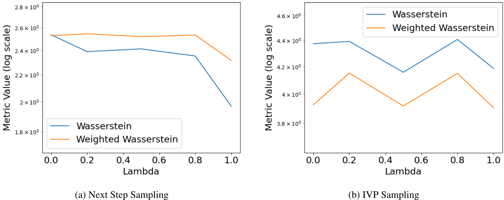

# Context-Aware Flow Matching for Trajectory Inference from Spatial Omics Data

*Table 24. Interpolation for holdout timestep 3 with IVP Sampling on the Liver Regeneration dataset.*

| $\lambda$ | $\mathcal{W}_2$ |
| :--- | :--- |
| 0 | $32.682 \pm 1.472$ |
| 0.2 | $34.647 \pm 1.461$ |
| 0.5 | $33.414 \pm 0.995$ |
| 0.8 | $33.512 \pm 0.786$ |
| 1 | $33.481 \pm 1.001$ |

 

*Table 21. Interpolation on the middle holdout timestep 3 on the Brain Regeneration dataset.*

| $\lambda$ | Next Step Sampling: Weighted $\mathcal{W}_2$ | Next Step Sampling: $\mathcal{W}_2$ | IVP Sampling: Weighted $\mathcal{W}_2$ | IVP Sampling: $\mathcal{W}_2$ |
| :--- | :--- | :--- | :--- | :--- |
| 0 | $2.528 \pm 0.143$ | $2.534 \pm 0.180$ | $3.925 \pm 0.267$ | $4.375 \pm 0.297$ |
| 0.2 | $2.544 \pm 0.093$ | $2.389 \pm 0.183$ | $4.153 \pm 0.432$ | $4.393 \pm 0.369$ |
| 0.5 | $2.519 \pm 0.167$ | $2.412 \pm 0.158$ | $3.917 \pm 0.343$ | $4.159 \pm 0.455$ |
| 0.8 | $2.533 \pm 0.137$ | $2.352 \pm 0.142$ | $4.151 \pm 0.193$ | $4.408 \pm 0.285$ |
| 1 | $2.316 \pm 0.141$ | $1.969 \pm 0.221$ | $3.905 \pm 0.395$ | $4.188 \pm 0.685$ |

 

(a) Next Step Sampling \hskip 100pt (b) IVP Sampling

*Figure 12. Performance variation with $\lambda$ for interpolation on the Brain Regeneration dataset.*

 

35
