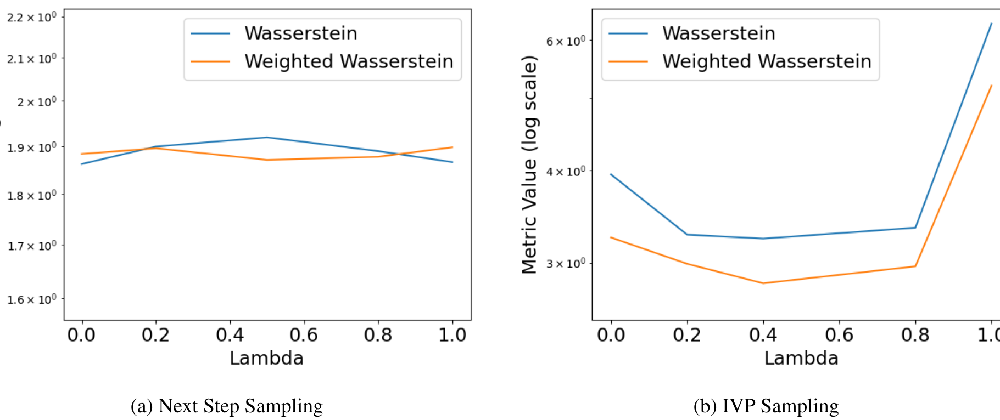
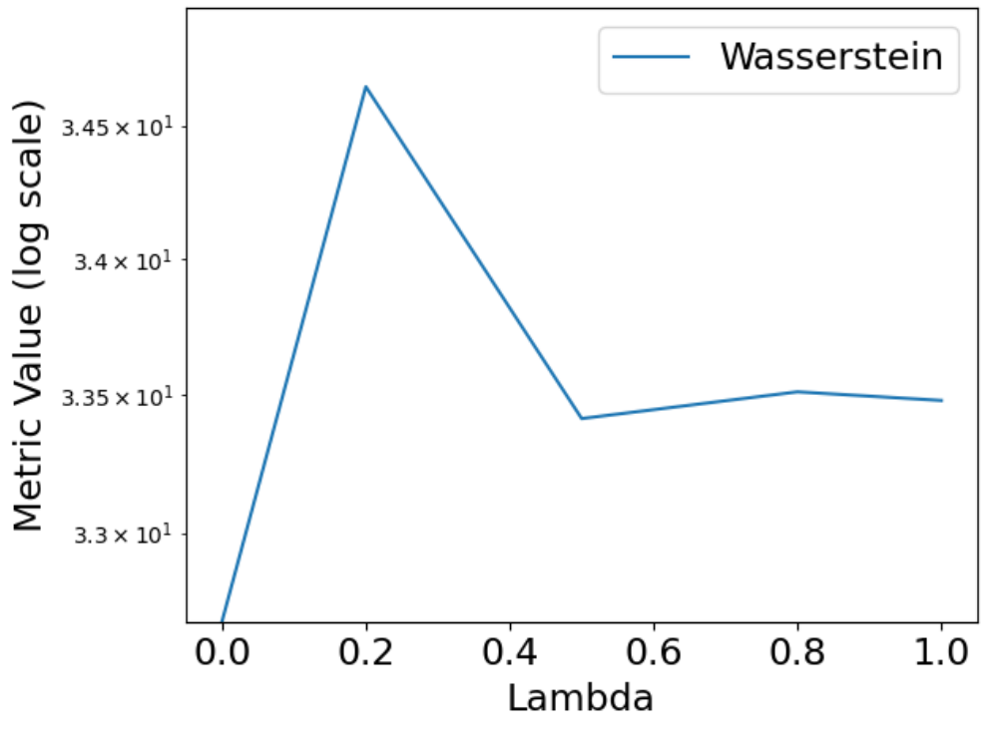

# Context-Aware Flow Matching for Trajectory Inference from Spatial Omics Data

Table 22. Interpolation for the holdout timestep 5 on the Mouse Organogenesis dataset.

| $\lambda$ | Next Step Sampling: Weighted $\mathcal{W}_2$ | Next Step Sampling: $\mathcal{W}_2$ | IVP Sampling: Weighted $\mathcal{W}_2$ | IVP Sampling: $\mathcal{W}_2$ |
| :--- | :--- | :--- | :--- | :--- |
| 0 | $1.884 \pm 0.027$ | $1.862 \pm 0.123$ | $3.244 \pm 0.713$ | $3.946 \pm 1.671$ |
| 0.2 | $1.896 \pm 0.028$ | $1.899 \pm 0.078$ | $2.990 \pm 0.205$ | $3.273 \pm 0.518$ |
| 0.5 | $1.871 \pm 0.030$ | $1.919 \pm 0.067$ | $2.814 \pm 0.414$ | $3.233 \pm 0.567$ |
| 0.8 | $1.878 \pm 0.031$ | $1.890 \pm 0.064$ | $2.966 \pm 0.411$ | $3.345 \pm 0.508$ |
| 1 | $1.898 \pm 0.029$ | $1.866 \pm 0.097$ | $5.200 \pm 0.799$ | $6.306 \pm 1.037$ |

(a) Next Step Sampling $\quad$ (b) IVP Sampling

36