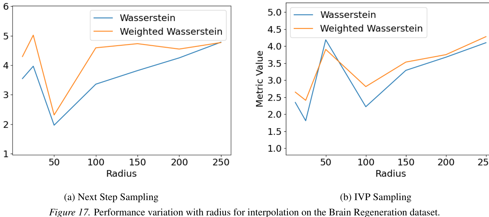

Context-Aware Flow Matching for Trajectory Inference from Spatial Omics Data

*Table 26. Interpolation for the middle holdout timestep 3 for CTF-H at $\lambda = 1$ (only using the spatial smoothness prior) on the Brain Regeneration dataset.*

| Radius | Next Step Sampling: Weighted $\mathcal{W}_2$ | Next Step Sampling: $\mathcal{W}_2$ | IVP Sampling: Weighted $\mathcal{W}_2$ | IVP Sampling: $\mathcal{W}_2$ |
| :--- | :--- | :--- | :--- | :--- |
| 12 | $4.293 \pm 0.318$ | $3.547 \pm 0.343$ | $2.650 \pm 0.204$ | $2.346 \pm 0.251$ |
| 25 | $5.019 \pm 0.270$ | $3.968 \pm 0.274$ | $2.408 \pm 0.239$ | $1.808 \pm 0.257$ |
| 50 | $2.316 \pm 0.141$ | $1.969 \pm 0.221$ | $3.905 \pm 0.395$ | $4.188 \pm 0.685$ |
| 100 | $4.590 \pm 0.360$ | $3.359 \pm 0.166$ | $2.812 \pm 0.240$ | $2.220 \pm 0.231$ |
| 150 | $4.731 \pm 0.424$ | $3.819 \pm 0.239$ | $3.533 \pm 0.220$ | $3.290 \pm 0.778$ |
| 200 | $4.548 \pm 0.780$ | $4.249 \pm 1.315$ | $3.751 \pm 0.725$ | $3.677 \pm 1.016$ |
| 250 | $4.768 \pm 1.994$ | $4.782 \pm 4.129$ | $4.281 \pm 0.985$ | $4.103 \pm 1.081$ |

(a) Next Step Sampling $\quad$ (b) IVP Sampling

*Figure 17. Performance variation with radius for interpolation on the Brain Regeneration dataset.*

38