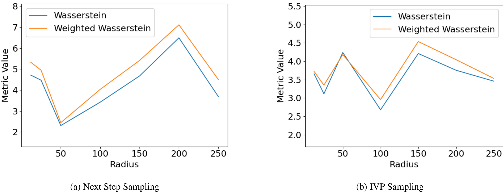

**Context-Aware Flow Matching for Trajectory Inference from Spatial Omics Data**

*Table 28. Interpolation for the middle holdout timestep 3 with CTF-H at $\lambda = 0.8$ on the Brain Regeneration dataset.*

| Radius | Next Step Sampling: Weighted $\mathcal{W}_2$ | Next Step Sampling: $\mathcal{W}_2$ | IVP Sampling: Weighted $\mathcal{W}_2$ | IVP Sampling: $\mathcal{W}_2$ |
| :--- | :--- | :--- | :--- | :--- |
| 12 | $5.320 \pm 1.714$ | $4.709 \pm 2.260$ | $3.722 \pm 1.114$ | $3.656 \pm 1.327$ |
| 25 | $4.943 \pm 1.384$ | $4.467 \pm 1.821$ | $3.350 \pm 1.548$ | $3.112 \pm 1.418$ |
| 50 | $2.440 \pm 0.090$ | $2.302 \pm 0.137$ | $4.181 \pm 0.035$ | $4.238 \pm 0.068$ |
| 100 | $4.028 \pm 0.648$ | $3.417 \pm 0.869$ | $2.956 \pm 0.580$ | $2.678 \pm 0.535$ |
| 150 | $5.408 \pm 0.889$ | $4.669 \pm 1.364$ | $4.535 \pm 0.823$ | $4.209 \pm 0.884$ |
| 200 | $7.110 \pm 2.581$ | $6.490 \pm 3.543$ | $4.043 \pm 1.441$ | $3.754 \pm 1.350$ |
| 250 | $4.502 \pm 0.573$ | $3.689 \pm 1.204$ | $3.532 \pm 1.148$ | $3.457 \pm 1.217$ |

(a) Next Step Sampling \hspace{100pt} (b) IVP Sampling

40