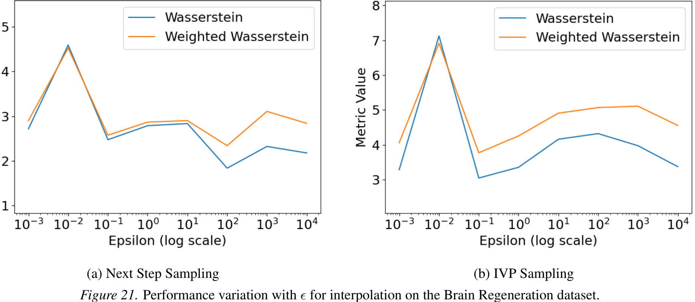

# Context-Aware Flow Matching for Trajectory Inference from Spatial Omics Data

*Table 30. Interpolation for the middle holdout timestep on the Brain Regeneration dataset.*

| $\epsilon$ | Next Step Sampling: Weighted $\mathcal{W}_2$ | Next Step Sampling: $\mathcal{W}_2$ | IVP Sampling: Weighted $\mathcal{W}_2$ | IVP Sampling: $\mathcal{W}_2$ |
| :--- | :--- | :--- | :--- | :--- |
| 0.001 | $2.899 \pm 0.582$ | $2.715 \pm 0.653$ | $4.056 \pm 0.542$ | $3.286 \pm 0.289$ |
| 0.01 | $4.520 \pm 2.066$ | $4.589 \pm 2.298$ | $6.915 \pm 3.573$ | $7.125 \pm 5.289$ |
| 0.1 | $2.573 \pm 0.476$ | $2.472 \pm 0.507$ | $3.772 \pm 0.642$ | $3.046 \pm 0.537$ |
| 1 | $2.865 \pm 0.612$ | $2.785 \pm 0.576$ | $4.255 \pm 0.679$ | $3.355 \pm 0.584$ |
| 10 | $2.899 \pm 0.865$ | $2.833 \pm 0.984$ | $4.908 \pm 1.130$ | $4.159 \pm 1.526$ |
| 100 | $2.338 \pm 0.101$ | $1.835 \pm 0.171$ | $5.069 \pm 0.985$ | $4.322 \pm 1.461$ |
| 1000 | $3.104 \pm 0.663$ | $2.321 \pm 0.521$ | $5.109 \pm 0.948$ | $3.974 \pm 1.227$ |
| 10000 | $2.838 \pm 0.281$ | $2.176 \pm 0.315$ | $4.557 \pm 0.710$ | $3.373 \pm 0.833$ |

(a) Next Step Sampling \hskip 100pt (b) IVP Sampling

*Figure 21. Performance variation with $\epsilon$ for interpolation on the Brain Regeneration dataset.*

---
42