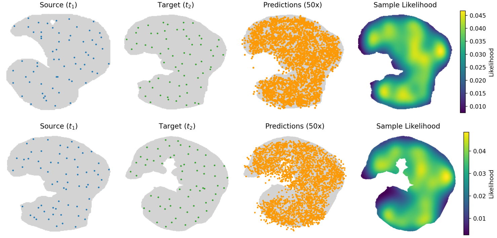

marizes the quantitative results for this ablation across three datasets: mouse embryonic development (MED), axolotl brain development (ABD), and mouse brain aging (MBA). We observe that using $K = 64$ consistently yields strong performance, achieving the highest 1NN-F1 scores on both the MED and MBA datasets, while also performing competitively on ABD. These findings indicate that $K = 64$ offers an effective balance between spatial resolution and stability, and we adopt it as the default configuration in our main experiments.

## D.7 Justifying the choice of NicheFlow over RPCFlow

Although RPCFlow achieves competitive performance on spatial metrics such as PSD and SPD, it lacks the essential capability of meaningful conditional generation. In RPCFlow, conditioning is performed using randomly sampled point clouds from the spatial regions without explicit microenvironment structure. As shown in Fig. 14, when conditioned on such random sources, RPCFlow tends to reconstruct the entire target tissue, rather than capturing local dynamics driven by the source input. This undermines its ability to model spatiotemporal evolution in a biologically grounded manner.

In contrast, NicheFlow is explicitly designed to push localized microenvironments through time. By conditioning on fixed-radius neighborhoods centered around specific spatial positions, the model learns how cellular contexts evolve, preserving both spatial coherence and transcriptional identity. Figure 15 visualizes this distinction: while NicheFlow consistently generates well-localized predictions aligned with the input microenvironment, RPCFlow fails to retain spatial specificity, often diffusing the prediction across broader regions.

From a biological perspective, predicting the fate of a local tissue region over time is far more relevant than mapping random point sets. Microenvironments encode structured cellular contexts, such as signaling interactions or niche-specific cell states, that are crucial for downstream analysis (e.g., lineage fate prediction, microenvironment-based intervention simulation). Because RPCFlow lacks this interpretability and fails to enable such downstream tasks, it cannot serve as a practical generative model in biological settings.

In summary, while RPCFlow may appear performant under some aggregate spatial metrics, only NicheFlow enables localized, conditionally consistent generation of evolving tissue regions. This makes it not only superior for evaluation but also for practical use in biological modeling.

## D.8 Structure-aware evaluation

While we refer to our primary evaluation metrics as PSD and SPD, they correspond to the two asymmetric directions of the Chamfer Distance (CD) - a widely used metric in point cloud generation [46]. PSD measures how closely the predicted points adhere to the ground truth structure (fidelity), while SPD captures how well the prediction covers the full extent of the target (coverage). We

28
